  
  <!-- dynamic typing effect 动态打字效果 -->
  

    
  

  <!-- knock code pictures 敲代码的图片 -->
   

  <!-- profile logo 个人资料徽标 -->
  

    &emsp;
    &emsp;
    &emsp;
    &emsp;
    &emsp;
    &emsp;
    &emsp;
    <!-- visitor statistics logo 访问量统计徽标 -->
    
  

<!-- Snake Code Contribution Map 贪吃蛇代码贡献图 -->
<picture>
  <source media="(prefers-color-scheme: dark)" srcset="https://cdn.jsdelivr.net/gh/svnyang/svnyang/assets/images/github-contribution-grid-snake-dark.svg" />
  <source media="(prefers-color-scheme: light)" srcset="https://cdn.jsdelivr.net/gh/svnyang/svnyang/assets/images/github-contribution-grid-snake.svg" />
  
</picture>

#  🙋 Hello

<table>
<tr><td>

<!-- About me 关于我 -->
### 🤺 About Me

&emsp;&emsp;大家好，我是孙同学。

&emsp;&emsp;热爱编程、设计、读书、剪纸、徒步。

&emsp;&emsp;热爱设计和开发，励志成为一名优秀的开发者。

&emsp;&emsp;且停且忘且随风，目行且看且从容。勿意，勿必，勿固、勿我

<strong>&emsp;&emsp;And stop and forget and wind, eye line and see and calm. Do not want, do not have to, do not solid, do not me</strong>

</td></tr>

<tr>
<td>
  
### 🏢 Work Experience

- [******（北京）有限公司](https://www.megagenomics.cn/) &emsp; 📌 2016-12-26 —— Now
  
  - 工作岗位：Web前端开发工程师（中级）
  - 工作内容：设计与开发相关

- [赞嘉电子科技（北京）有限公司]() &emsp; 📌 2015-12-30 —— 2016-12-26
  
  - 工作岗位：Web前端开发实习生
  - 工作内容：设计与开发相关

</td>
</tr>

<tr><td>

<!-- 近期博客 -->
### 📃 Recent Blog
  

<!-- START_SECTION:blog -->
* <a href='https://www.designnotes.cn/' target='_blank'>Design Notes 收集全球优质免费资源</a> - 2023-11-12
* <a href='https://sunyang.vip/' target='_blank'>个人网站</a> - 2023-06-06
<!-- END_SECTION:blog -->

</td></tr>

<tr><td>

### 🤾‍♂️ Funny Soul

<!-- START_SECTION:douban -->
* <a href='https://book.douban.com/subject/33420947/' target='_blank'>三体</a> 🌟🌟🌟🌟🌟 力荐- 2023-02-10
* <a href='https://book.douban.com/subject/1829226/' target='_blank'>肖申克的救赎</a> 🌟🌟🌟🌟🌟 力荐- 2022-03-11
* <a href='https://book.douban.com/subject/4913064/' target='_blank'>活着</a> 🌟🌟🌟🌟🌟 力荐- 2022-01-05
<!-- END_SECTION:douban -->

</td></tr>

<tr><td>

<!-- wakatime 统计 -->
### 📊 WakaTime

<picture>
  <source
    srcset="https://github-readme-stats.vercel.app/api?username=svnyang&show_icons=true&theme=tokyonight"
    media="(prefers-color-scheme: dark)"
  />
  
</picture>

</td></tr>

</table>

<!-- ########################################## 分割 ########################################## -->

<!-- just img 图片 -->

<!--  skill badge 技能徽章 -->

```mermaid
mindmap
  root((孙同学))
    编程
      Web开发
      设计
      人工智能
    手工
      剪纸
    旅行
      北京
      黑龙江
      西安
      上海
      延边
      武汉
    阅读
      三体
      活着
      肖申克的救赎
```

💪 正在学习

  
🧰 常用的工具

<!-- programming tool icon 编程工具图标 -->
 

<!-- svg -->

 

 

<!-- gif -->

<!-- just img 图片 -->

<!-- profile-3d-contrib 3D贡献图-->

<!-- ########################################## 分割 ########################################## -->

  
  
<!-- GitHub 奖杯🏆 -->
 

<!-- GitHub 数据统计 -->

  

<!-- Wakatime Graph-->
<table>
  <tr>
    <td></td>
    <td></td>
  </tr>
</table>

<!-- ########################################## 分割 ########################################## -->

<!-- run 图片 -->

<!-- Joke 笑话 -->

<!-- github-readme-streak-stats 连续提交代码天数记录 -->
&emsp;

&emsp;

<!-- GitHub Activity Graph GitHub 活动图 -->
<table align="center">
  <tr>
    <td></td>
  </tr>
</table>

<!-- ########################################## 分割 ########################################## -->

<!-- GitHub metrics 信息指标 -->

<!-- just img 图片 -->

<!-- first form 第一个表格 -->
<table>
  <tr>
    <td></td>
  </tr>
</table>

<!-- just img 图片 -->

